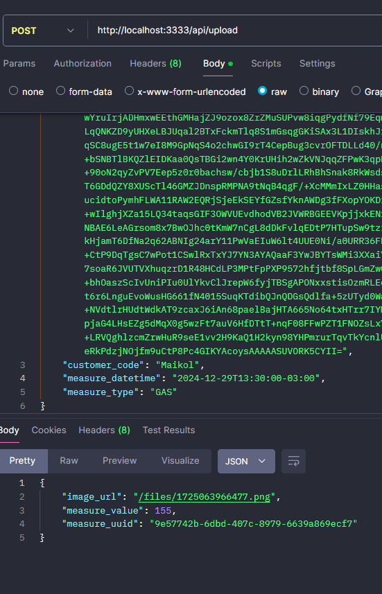
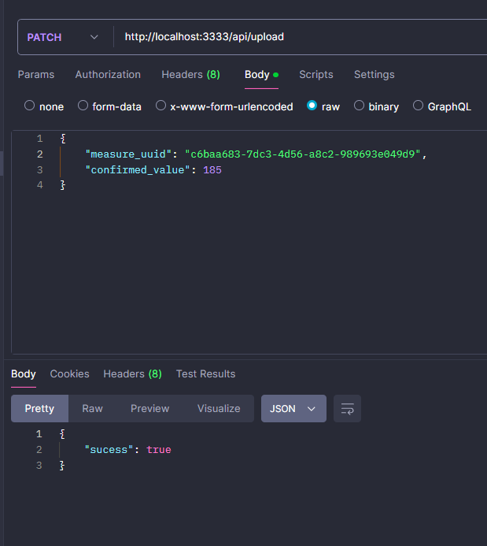

<div align="center">
  <h1>Teste Shopper: Leitura de água e gás com Inteligência Artificial</h1>
</div>

**Desafio:** Desenvolver uma API REST utilizando TypeScript e Node, de um serviço que gerencia a leitura individualizada de
consumo de água e gás.

<br/>

## Endpoints

**POST /upload**<br/>
> Responsável por receber uma imagem em base 64, consultar o Gemini e retornar a medida lida pela API
> Request Body
```
 {
  image: "base64",
  customer_code: "string",
  measure_datetime: "datetime",
  measure_type: "WATER" | "GAS"
}
```
</br>
>Response

</br>

**PATCH /confirm**<br/>
> Responsável por confirmar ou corrigir o valor lido pelo LLM
> Request Body
```
{
  measure_uuid: "string",
  confirmed_value: "integer"
}
```
</br>
>Response

</br>

**GET /:customer_code/list**<br/>
> Responsável por listar as medidas realizadas por um determinado cliente
- Request Params *( /:customer_code/list?query=value)*
```
// Request query opcional
measure_type: "WATER" | "GAS"
```

<br/>
>Response


<br/>

## Como executar? ( Docker )

```bash
git clone https://github.com/Maikol031/Teste-Shopper.git

cd backend
```

Crie seu arquivo .env e coloque sua Chave de API do Gemini.
Essa chave pode ser adquirida através 

```ts
// .env
GEMINI_API_KEY="CHAVE"
APP_PORT=3333
URI_MONGODB="mongodb://mongo:27017/shopper"
```

Inicie o contêiner
```bash
docker compose up
# Aplicação rodando em localhost:3333
```

<br/>
## Estrutura do Projeto
backend/
├── dist/
├── node_modules/
├── src/
│   ├── AI/
│   ├── controllers/
│   ├── db/
│   ├── entities/
│   ├── repositories/
│   ├── routes/
│   ├── uploads/
│   ├── usecases/
│   ├── app.ts
│   └── server.ts
├── .dockerignore
├── .env
├── .env.example
├── .gitignore
├── docker-compose.yml
├── Dockerfile
├── package-lock.json
├── package.json
├── tsconfig.build.json
├── tsconfig.json
├── LICENSE
└── README.md
<br/>
## Tecnologias usadas
- Docker
- TypeScript
- NodeJS
- MongoDB